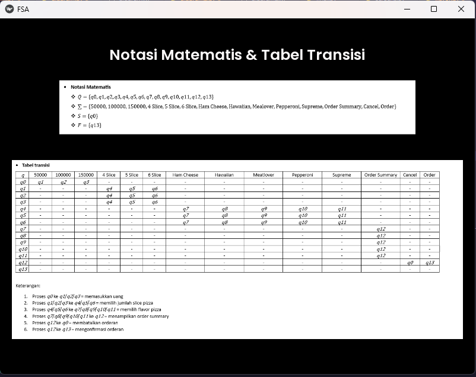

# FSA_OUTPUT
FSA OUTPUT (Finite State Automaton Output) is a project that was implemented as part of the final assignment for the Automata & Compilation course. This project aims to produce output based on the Finite State Automaton concept that has been studied. This FSA OUTPUT project provides a practical understanding of the FSA concept and how to implement it in a real context. It is hoped that this project can increase understanding of state-based system modeling and produce relevant output based on the state transitions that occur. The FSA OUTPUT project is expected to provide better insight into the FSA concept and provide practical experience in implementing Finite State Automaton in real projects. In the FSA OUTPUT project assignment we made is Vending Machine Pizza, Vending Machine Pizza is a project created as part of the final project for the Automata & Compilation course. This project aims to implement a vending machine that can accept pizza orders from users.
## Honed Skill
1. Programming
2. Konsep Konsep FSA
3. Desain Sistem
4. Implementasi Logika FSA
5. Pengembangan Antarmuka Pengguna
6. Validasi Input dan Pengontrolan Flow
7. Penanganan Kesalahan
8. Kolaborasi Tim
9. Expertise in GUI Framework
10. Problem solving skill
## Tools and Languages Used in This Portfolio
1. Python Programming Language
2. Kivy
3. Kivymd
4. Visual_Automata
## The purpose of application development
* Application of the FSA Concept: This application aims to apply the Finite State Automaton (FSA) concept in a real context, namely a pizza vending machine. By creating this application, you will gain a better understanding of how FSA is used to represent systems that operate based on states and transitions.
* Practical Learning: This app is designed as part of a final assignment or student project, so the aim is to provide a practical learning experience. Through this programming application development, you will hone your skills, systems design, user interface development, and practical FSA concepts.
* Vending Machine Simulation: The main goal of this application is to simulate a pizza vending machine that operates according to the FSA principle. Users can enter money, choose pizza sizes and flavors, and see the order's perfection. This application provides an interactive experience for users to understand how vending machines work.
* Increase Understanding of Concepts: By developing FSA OUTPUT pizza vending machine applications, you will deepen your understanding of FSA concepts, such as states, transitions, inputs, and outputs. This application allows you to see these concepts in real action and understand how FSA can be used to model complex systems.
* Demonstration of Ability: This application can also be used as a demonstration of your ability to implement FSA concepts in real projects. You can use this application to express your knowledge and skills in system design, programming and user interface development.
## User Interface Graphical Display
### For Display Welcome Page

### For Display Input Money Page

### For Display Chosse Slice Page

### For Display Flavor Page

### For Display Order Summary Page

### For Display Cancel Page

### For Display Waiting Order Page

### For Display Diagram Page

### For Display tabel Page

